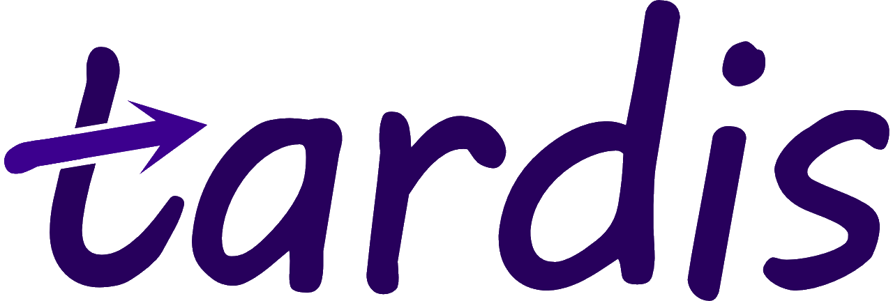

# Temporal analysis of relative distances
Public releases of the TARDIS software

TARDIS (Temporal Analysis of Relative Distances) is a software created to get unbiased and accurate single-particle tracking (spt) information directly from localization data. It is especially powerful in difficult spt conditions, such as heavily blinking particles, high density of localizations, or with a lot of additional noise. The full overview of the scientific implementation of the algorithms underlying TARDIS can be found in the manuscript:

[Martens et al., “Temporal analysis of relative distances (TARDIS) is a robust, parameter-free alternative to single-particle tracking”, Nature Methods (2024)](https://rdcu.be/dv1sr)

## Getting started
The latest release can be found [here](https://github.com/kjamartens/TARDIS-public/releases/tag/release_v121)

TARDIS can generally be run via a graphical user-interface or as a standalone set of scripts in MATLAB. 
For a quick overview of the TARDIS software with graphical user-interface, read ["Getting started with TARDIS"](./Getting_started_with_TARDIS_v120.pdf).
For a full detailed description of all TARDIS details, read ["the TARDIS Manual"](./TARDIS_Manual_v120.pdf)

### Licence
CC BY-NC-SA 4.0 licence
